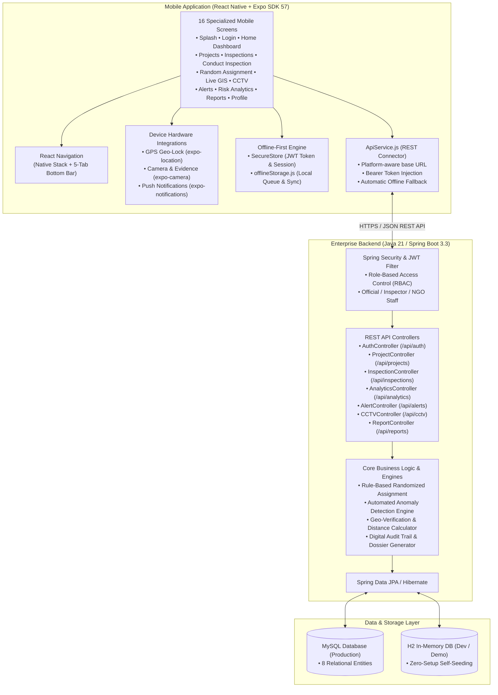

# DoSJE Real-Time Monitoring & Digital Inspection Management System
> **Department of Social Justice and Empowerment (Govt. of India)**  
> *e-NirikShan — Digital Governance, Real-Time Field Monitoring & Automated Anomaly Detection Platform*

---

## 1. Complete Project File & Directory Structure

```
Build-with-Bharat-2.0/
│
├── README.md                                 # Master System Architecture & Execution Documentation
│
├── CLIENT/                                   # React Native + Expo Mobile Application
│   ├── App.js                                # Application Root Component, Providers & Notification Init
│   ├── index.js                              # Expo Root Registry Entry
│   ├── app.json                              # Mobile App Config (Name, Version, Permissions, Camera/GPS)
│   ├── package.json                          # NPM Dependencies & Build Scripts (Expo SDK 57, React 19)
│   └── src/
│       ├── navigation/
│       │   └── AppNavigator.js               # React Navigation (Native Stack + 5-Tab Bottom Bar)
│       │
│       ├── screens/                          # 16 Complete Mobile Inspection & Monitoring Screens
│       │   ├── SplashScreen.js               # Screen 1: Official Emblem Animation & Auto-Routing
│       │   ├── LoginScreen.js                # Screen 2: Multi-Role Auth (Official, Inspector, NGO Staff)
│       │   ├── HomeScreen.js                 # Screen 3 & 9: Official KPI Dashboard & Inspector Field View
│       │   ├── ProjectsScreen.js             # Screen 4: Project Directory with Search & Filter Chips
│       │   ├── ProjectDetailsScreen.js       # Screen 5: Scheme Details, Compliance Score & GIS Location
│       │   ├── InspectionsScreen.js          # Screen 6: Inspection Queue with Status Tabs (Assigned, Flagged...)
│       │   ├── InspectionDetailsScreen.js    # Screen 7: Audit Dossier, Timeline & Digital Evidence Tokens
│       │   ├── RandomAssignmentScreen.js     # Screen 8: Rule-Based Randomized Inspector Allocation
│       │   ├── ConductInspectionScreen.js    # Screen 10: 7-Step Field Inspection Flow (GPS, Attendance, Checklist, Geo-Photo)
│       │   ├── LiveMonitoringScreen.js       # Screen 11: Real-time GIS Interactive Color-Coded Risk Pins
│       │   ├── CCTVScreen.js                 # Screen 12: CCTV Grid with Online/Offline Status & Stream Frames
│       │   ├── AlertsScreen.js               # Screen 13: Severity-Categorized Real-Time Anomaly Alerts
│       │   ├── RiskAnalyticsScreen.js        # Screen 14: Automated Anomaly Scorecards & Risk Factors
│       │   ├── ReportsScreen.js              # Screen 15: PDF / CSV Inspection Audit Dossier Generator
│       │   └── ProfileScreen.js              # Screen 16: Officer Profile, Security Clearance & Logout
│       │
│       ├── services/
│       │   ├── apiService.js                 # Universal REST API Client (Platform-Aware, JWT Auth, Offline Fallback)
│       │   └── notificationService.js        # Expo Local & Push Notification Dispatcher
│       │
│       ├── storage/
│       │   └── offlineStorage.js             # Local Offline Persistence Queue & Sync Engine
│       │
│       ├── utils/
│       │   └── anomalyDetection.js           # Rule-Based Anomaly Scoring & Evaluation Engine
│       │
│       ├── theme/
│       │   └── theme.js                      # Government Dark Green Palette, Typography & 44px+ Touch Targets
│       │
│       └── data/
│           └── mockData.js                   # Realistic Government Seed & Offline Fallback Datasets
│
└── Backend/                                  # Java 21 / Spring Boot 3.3 Enterprise Backend
    ├── pom.xml                               # Maven Build Configuration & Dependencies
    └── src/
        ├── main/
        │   ├── resources/
        │   │   ├── application.properties    # MySQL Production Database Configuration
        │   │   ├── application-dev.properties# H2 In-Memory Zero-Setup Dev Configuration
        │   │   └── schema.sql                # Relational DDL & SQL Schema
        │   │
        │   └── java/com/dosje/monitoring/
        │       ├── MonitoringApplication.java # Spring Boot Main Application Entry Point
        │       │
        │       ├── config/                   # Security, JWT, CORS & Seed Data Initializers
        │       │   ├── SecurityConfig.java   # Spring Security Filter Chain & RBAC Configuration
        │       │   ├── JwtTokenProvider.java # 256-bit JWT Token Generation & Verification
        │       │   ├── JwtAuthenticationFilter.java # Stateless Request Authorization Filter
        │       │   ├── CorsConfig.java       # Cross-Origin Resource Sharing (CORS) Configuration
        │       │   └── DataInitializer.java  # Auto-seeds realistic demo records on startup
        │       │
        │       ├── controller/               # 7 REST API Controllers
        │       │   ├── AuthController.java   # /api/auth/login
        │       │   ├── ProjectController.java# /api/projects, /api/projects/{id}
        │       │   ├── InspectionController.java # /api/inspections, assign, random-assign, gps, attendance, evidence, submit
        │       │   ├── AnalyticsController.java  # /api/analytics/dashboard, /api/analytics/risk
        │       │   ├── AlertController.java  # /api/alerts, /api/alerts/{id}/read
        │       │   ├── CCTVController.java   # /api/cctv
        │       │   └── ReportController.java # /api/reports, /api/reports/generate
        │       │
        │       ├── service/                  # Business Logic & Algorithms
        │       │   ├── AuthService.java      # User Authentication & Token Generation
        │       │   ├── ProjectService.java   # Project Lifecycle & Directory Management
        │       │   ├── InspectionService.java# Inspection Workflow & Field State Transitions
        │       │   ├── RandomAssignmentService.java # Rule-Based Distance & Workload Allocation Algorithm
        │       │   ├── RiskAnalysisService.java     # Dynamic Risk Scoring & Anomaly Detection Algorithm
        │       │   ├── AnalyticsService.java # KPI Dashboard Aggregation
        │       │   ├── AlertService.java     # Automated Alert Dispatching & Anomaly Triggers
        │       │   ├── CCTVService.java      # Camera Status & Video Stream Verification
        │       │   └── ReportService.java    # Audit Dossier & PDF/CSV Export Assembly
        │       │
        │       ├── entity/                   # 8 Relational JPA Database Entities
        │       │   ├── User.java             # User Accounts & Officer Profiles
        │       │   ├── Role.java             # Enums: ROLE_DOSJE_OFFICIAL, ROLE_PMU_INSPECTOR, ROLE_PROJECT_STAFF
        │       │   ├── Project.java          # Registered Institutes, NGOs & Schemes
        │       │   ├── Inspection.java       # Field Inspection Records & Audit Tokens
        │       │   ├── Evidence.java         # Geo-Tagged Photos, Videos & Timestamps
        │       │   ├── Attendance.java       # Biometric Staff & Beneficiary Verification Counts
        │       │   ├── Alert.java            # Critical, High, Medium System Anomaly Alerts
        │       │   ├── CCTV.java             # CCTV Surveillance Grid Feeds & Signals
        │       │   └── Report.java           # Official Inspection Audit Reports
        │       │
        │       ├── repository/               # 8 Spring Data JPA Repositories
        │       │   ├── UserRepository.java
        │       │   ├── ProjectRepository.java
        │       │   ├── InspectionRepository.java
        │       │   ├── EvidenceRepository.java
        │       │   ├── AttendanceRepository.java
        │       │   ├── AlertRepository.java
        │       │   ├── CCTVRepository.java
        │       │   └── ReportRepository.java
        │       │
        │       └── dto/                      # Data Transfer Objects (Request/Response Payloads)
        │           ├── ApiResponse.java      # Universal Standard JSON Response Wrapper
        │           ├── LoginRequest.java     # Login Payload (username/officialId, password)
        │           ├── LoginResponse.java    # Login Result (JWT Token, User Profile, Roles)
        │           ├── AssignInspectionRequest.java
        │           ├── RandomAssignRequest.java
        │           ├── GPSVerificationRequest.java
        │           ├── AttendanceVerificationRequest.java
        │           ├── EvidenceRequest.java
        │           ├── InspectionSubmitRequest.java
        │           ├── DashboardStatsDTO.java
        │           └── RiskAnalyticsDTO.java
        │
        └── test/                             # Automated Unit & Integration Tests
            └── java/com/dosje/monitoring/
                ├── MonitoringApplicationTests.java # Context Load & Startup Tests
                └── ApiControllerTests.java         # 12 REST API & Security Filter Tests
```

---

## 2. System Architecture Diagram



---

## 3. Layer-by-Layer Architectural Breakdown

### **Layer 1: Presentation & Mobile UX Layer (`CLIENT/src/screens`)**
- **Framework**: React Native with Expo SDK 57 (React 19, React Native 0.86).
- **Navigation Structure**:
  - `BottomTabNavigator`: 5 main tabs (*Home, Inspections, Projects, Alerts, Profile*).
  - `NativeStackNavigator`: Full-screen transitions for *Project Details, Inspection Details, Conduct Field Inspection, Random Assignment, Live GIS, CCTV, and Reports*.
- **UI Guidelines**: Government-standard dark green theme (`#1b5e20`), touch targets $\ge 44 \times 44\text{ px}$, `SafeAreaView` and `KeyboardAvoidingView` support.

### **Layer 2: Device Hardware & Sensors**
- **GPS Verification**: Uses `expo-location` to lock latitude, longitude, and accuracy tokens during on-site inspections.
- **Geo-Tagged Digital Evidence**: Uses `expo-camera` and `expo-image-picker` to capture time-stamped, coordinate-stamped photos.
- **Push & Local Notifications**: Uses `expo-notifications` for real-time inspection assignment dispatch and critical anomaly warnings.

### **Layer 3: Offline-First Persistence Engine**
- **Token Security**: Uses `expo-secure-store` for 256-bit encrypted storage of JWT tokens and session data.
- **Local Sync Queue**: Implemented in `offlineStorage.js` to store field inspection reports locally when field inspectors have no internet connectivity, automatically syncing to the cloud backend once reconnected.

### **Layer 4: Enterprise Backend (Spring Boot 3.3)**
- **Architecture**: Strict Layered MVC (`controller`, `service`, `repository`, `entity`, `dto`, `security`, `config`).
- **Security & RBAC**: Stateless JWT authentication filter with roles:
  - `ROLE_DOSJE_OFFICIAL`: Central/State dashboard, project oversight, random inspection assignment, reports.
  - `ROLE_PMU_INSPECTOR`: Field inspection target queue, GPS lock, attendance logging, evidence capture.
  - `ROLE_PROJECT_STAFF`: Project details, compliance status, and CCTV streams.
- **Core Algorithms**:
  - **Rule-Based Randomized Assignment**: Selects inspectors based on proximity, workload balance, and rotational entropy to eliminate conflict of interest.
  - **Rule-Based Anomaly Detection**: Evaluates biometric attendance drops $> 20\%$, inspection overdue intervals $> 3\text{ days}$, and CCTV dropouts.

### **Layer 5: Database & Persistence Layer**
- **Relational Model (8 Entities)**: `User`, `Project`, `Inspection`, `Evidence`, `Attendance`, `Alert`, `CCTV`, `Report`.
- **Dual Database Support**:
  - Production: MySQL with Spring Data JPA and connection pooling.
  - Dev/Demo: In-memory H2 database with automatic seed data initialized on boot via `DataInitializer.java`.

---

## 4. Inspection Lifecycle Data Flow

```
[DoSJE Official / Central Cell]
               │
      (1) Assign Inspection (Manual or Rule-Based Randomized)
               │
               ▼
[PMU Field Inspector Mobile App]
               │
      (2) Inspector Receives Push Notification & Navigates to Site
      (3) Step 1: GPS Lock & Geo-Verification (expo-location)
      (4) Step 2: Biometric Attendance Logging (Calculates % & Flag)
      (5) Step 3: 7-Point Compliance Checklist (Infrastructure, Records, Safety, etc.)
      (6) Step 4: Capture Geo-Tagged Photographic Evidence
      (7) Step 5 & 6: Observations & Risk Rating
      (8) Step 7: Final Submit & Digitally Signed Dossier
               │
               ▼
[Spring Boot Backend & Anomaly Detection Engine]
               │
      (9) Validates Evidence, Evaluates Risk Score & Logs Audit Trail
      (10) Dispatches Automated Critical Alerts if Attendance < 80%
               │
               ▼
[Central Dashboard & Official Reports]
```

---

## 5. REST API Endpoint Map

| Category | Route | Method | Purpose |
| :--- | :--- | :--- | :--- |
| **Auth** | `/api/auth/login` | `POST` | Authenticates user and returns JWT token + profile |
| **Projects** | `/api/projects` | `GET` | Lists all projects with filter parameters |
| **Projects** | `/api/projects/{id}` | `GET` | Returns project details and coordinates |
| **Inspections**| `/api/inspections` | `GET` | Retrieves inspection queue filtered by status |
| **Assignment** | `/api/inspections/random-assign` | `POST` | Executes rule-based randomized allocation |
| **Assignment** | `/api/inspections/assign` | `POST` | Manually assigns inspector to project |
| **GPS** | `/api/inspections/{id}/gps` | `POST` | Verifies and stores geo-coordinates |
| **Attendance** | `/api/inspections/{id}/attendance` | `POST` | Logs staff/beneficiary counts & anomaly status |
| **Evidence** | `/api/inspections/{id}/evidence` | `POST` | Registers geo-tagged media evidence |
| **Submission** | `/api/inspections/{id}/submit` | `POST` | Submits finalized inspection audit |
| **Analytics** | `/api/analytics/dashboard` | `GET` | Returns high-level dashboard KPIs and trends |
| **Analytics** | `/api/analytics/risk` | `GET` | Returns risk distribution and anomaly scorecards |
| **Alerts** | `/api/alerts` | `GET` | Fetches real-time alert feed |
| **Alerts** | `/api/alerts/{id}/read` | `PUT` | Marks an alert notification as read |
| **CCTV** | `/api/cctv` | `GET` | Lists CCTV camera status and live feed links |
| **Reports** | `/api/reports/generate` | `POST` | Generates official PDF/CSV audit dossiers |

---

## 6. Execution Guide

### Backend:
```bash
cd Backend
# Run with zero-setup in-memory database:
mvn spring-boot:run -Dspring-boot.run.profiles=dev
```

### Mobile Frontend:
```bash
cd CLIENT
# Start Expo development server:
npx expo start
```
- Press `w` to open web preview.
- Or scan QR code using **Expo Go** on Android/iOS.
